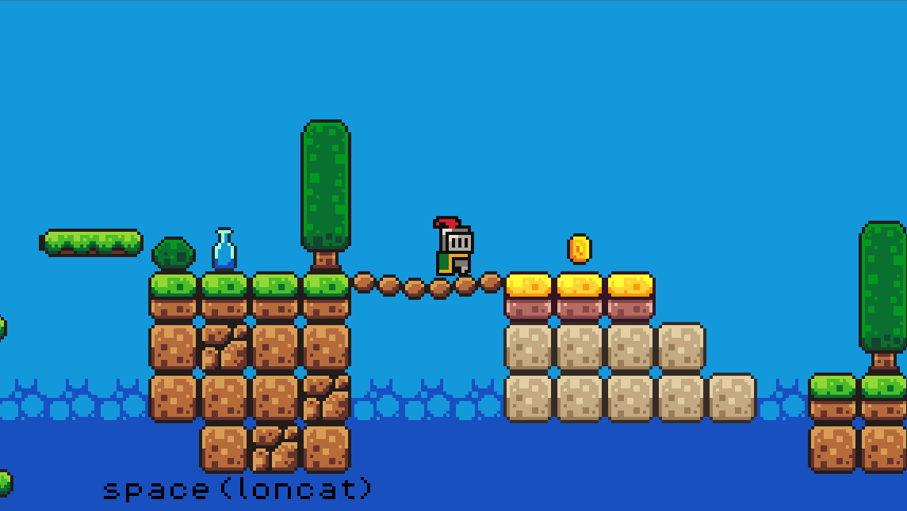
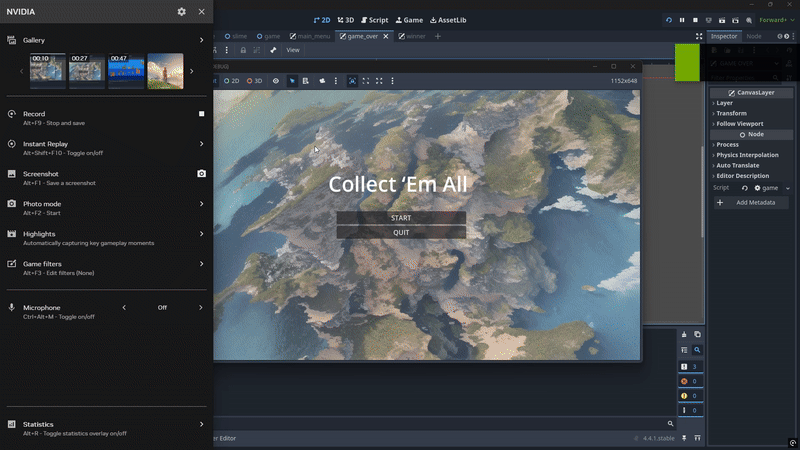

<!-- 

<div align="center">
  
  
  
</div>

-->

<div align="center">

# Collect 'Em All

**A 2D Pixel Art Platformer made with Godot Engine**

[EN](README.md) | [ID](README.id.md)

</div>

---

## 🇬🇧 English Version

### 📜 Game Description

**Collect 'Em All** is a classic 2D pixel art platformer built with the powerful and open-source **Godot Engine**. The game focuses on fast-paced fun, challenging exploration, and satisfying collection mechanics. With a charming retro art style, players control a valiant knight on a quest to navigate treacherous levels, defeat quirky slime enemies, and, most importantly, collect every last coin!

### ✨ Features

-   **Classic 2D Platforming:** Enjoy responsive controls for running, jumping, and navigating levels.
-   **Pixel Art Aesthetics:** A retro-inspired visual style brings the world and its characters to life.
-   **Collectible-Focused Gameplay:** The main objective is to explore each level thoroughly to find and collect all the coins.
-   **Enemies & Hazards:** Face off against slime enemies and avoid dangerous traps like killzones.
-   **Immersive Audio:** Features engaging background music and a full suite of sound effects for actions like jumping, collecting coins, and taking damage.
-   **Centralized Game Management:** A robust `game_manager.gd` script handles scoring, state tracking, and overall game flow.

### 📌 Preview Game

**Main Menu — Start Screen**


**In-Game Action**


**Lose Screen**


**Win Screen**


### 🎮 Gameplay Preview

| Gameplay 1 | Gameplay 2 |
| :---: | :---: |
|  | .gif) |
| **Gameplay 3** | **Gameplay 4** |
| .gif) | .gif) |

### 📂 Folder Structure

The project maintains a clean and organized structure for easy navigation and development.

```
/
├── assets/         # All game assets (sprites, fonts, music, sounds)
├── scenes/         # Godot scenes (.tscn) and their attached scripts (.gd)
├── scripts/        # Global scripts, like the game manager
├── project.godot   # The main Godot project file
└── README.md       # This file
```

### 🎮 How to Play

The goal is simple: guide the knight through each level and **collect all the coins** to win.

-   Navigate the platforms carefully.
-   Avoid or defeat the slime enemies that stand in your way.
-   Watch out for deadly killzones and other traps.
-   Grab power-ups to help you on your quest.

### 🚀 How to Run the Project

To run this game, you need to have the Godot Engine installed.

1.  Clone or download this repository to your local machine.
2.  Open the **Godot Engine** (version 4.5.1 is recommended).
3.  In the Project Manager, click the **"Import"** button.
4.  Browse to the cloned repository folder and select the `project.godot` file.
5.  Once imported, select the project from the list and click **"Run"** (or press `F5`).

### 📋 Requirements

-   **Godot Engine v4.5.1** or newer.

### 🕹️ Controls

| Action    | Keyboard      |
| :-------- | :------------ |
| Move Left | `Left Arrow`  |
| Move Right| `Right Arrow` |
| Jump      | `Spacebar`    |

### 🏆 Credits

-   **Game Music & SFX:** [Brackeys Platformer Bundle](https://brackeysgames.itch.io/brackeys-platformer-bundle) by Brackeys.
-   **Fonts:** [PixelOperator8](https://godotengine.org/asset-library/asset/1985) from Godot Asset Library.
-   **Game Development:** (Your Name/Studio)

*Some assets in this project are not mine. All visual and audio assets taken from third parties remain under the licenses of their respective creators. Assets I created myself are free to use under the project's main license.*

### 📄 License

This project is licensed under the **MIT License**.  
See the `LICENSE` file for more details.

---
---

## 🇮🇩 Versi Indonesia

### 📜 Deskripsi Game

**Collect 'Em All** adalah game platformer 2D dengan gaya pixel art klasik yang dibangun menggunakan **Godot Engine**, sebuah game engine open-source yang andal. Game ini berfokus pada permainan yang seru, eksplorasi yang menantang, dan mekanik koleksi yang memuaskan. Dengan gaya seni retro yang menawan, pemain mengontrol seorang ksatria pemberani dalam misi untuk menjelajahi level-level berbahaya, mengalahkan musuh slime yang unik, dan yang terpenting, mengumpulkan semua koin!

### ✨ Fitur

-   **Platformer 2D Klasik:** Nikmati kontrol yang responsif untuk berlari, melompat, dan menjelajahi level.
-   **Estetika Pixel Art:** Gaya visual yang terinspirasi dari game retro untuk menghidupkan dunia dan karakternya.
-   **Gameplay Berbasis Koleksi:** Tujuan utamanya adalah menjelajahi setiap level secara menyeluruh untuk menemukan dan mengumpulkan semua koin.
-   **Musuh & Rintangan:** Hadapi musuh slime dan hindari jebakan berbahaya seperti killzone.
-   **Audio Imersif:** Dilengkapi musik latar yang menarik dan serangkaian efek suara untuk berbagai aksi seperti melompat, mengambil koin, dan terkena serangan.
-   **Manajemen Game Terpusat:** Skrip `game_manager.gd` yang solid menangani skor, status permainan, dan alur game secara keseluruhan.

### 📂 Struktur Folder

Proyek ini menjaga struktur yang bersih dan terorganisir untuk kemudahan navigasi dan pengembangan.

```
/
├── assets/         # Semua aset game (sprite, font, musik, suara)
├── scenes/         # Scene Godot (.tscn) dan skrip yang terpasang (.gd)
├── scripts/        # Skrip global, seperti game manager
├── project.godot   # File utama proyek Godot
└── README.md       # File ini
```

### 🎮 Cara Bermain

Tujuannya sederhana: pandu ksatria melewati setiap level dan **kumpulkan semua koin** untuk menang.

-   Jelajahi platform dengan hati-hati.
-   Hindari atau kalahkan musuh slime yang menghalangi jalanmu.
-   Waspadai killzone mematikan dan jebakan lainnya.
-   Ambil power-up untuk membantumu dalam petualangan.

### 🚀 Cara Menjalankan Proyek

Untuk menjalankan game ini, Anda harus sudah menginstal Godot Engine.

1.  *Clone* atau unduh repositori ini ke komputer Anda.
2.  Buka **Godot Engine** (disarankan versi 4.5.1).
3.  Di Manajer Proyek, klik tombol **"Import"**.
4.  Arahkan ke folder repositori yang sudah di-*clone* dan pilih file `project.godot`.
5.  Setelah terimpor, pilih proyek dari daftar dan klik **"Run"** (atau tekan `F5`).

### 📋 Persyaratan

-   **Godot Engine v4.5.1** atau yang lebih baru.

### 🕹️ Kontrol

| Aksi          | Keyboard        |
| :------------ | :-------------- |
| Gerak Kiri    | `Panah Kiri`    |
| Gerak Kanan   | `Panah Kanan`   |
| Lompat        | `Spasi`         |

### 🏆 Kredit

-   **Musik Game & SFX:** [Brackeys Platformer Bundle](https://brackeysgames.itch.io/brackeys-platformer-bundle) oleh Brackeys.
-   **Font:** [PixelOperator8](https://godotengine.org/asset-library/asset/1985) dari Godot Asset Library.
-   **Pengembang Game:** (Nama Anda/Studio)

*Beberapa aset dalam proyek ini bukan milik saya. Semua aset visual dan audio yang diambil dari pihak ketiga tetap mengikuti lisensi masing-masing pembuatnya. Aset yang saya buat sendiri bebas digunakan mengikuti lisensi utama proyek ini.*

### 📄 Lisensi

Proyek ini dilisensikan di bawah **Lisensi MIT**. Lihat file `LICENSE` untuk detail lebih lanjut.